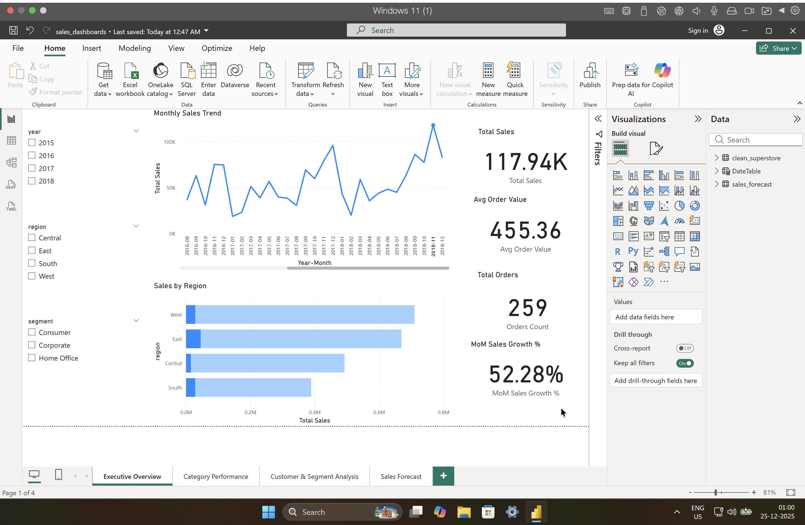

## Predictive Analysis – Sales Forecasting

After analyzing historical sales trends, a time-series forecasting model
(Exponential Smoothing) was implemented to predict sales for the next
6 months.

### Why this model?
- Suitable for short-term business forecasting
- Captures recent trends effectively
- Easy to interpret for business stakeholders

### Output
- Forecasted sales data generated using Python
- Visualized using Power BI

### Views

